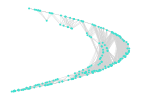

# Recurrence Networks

Recurrence matrices can be reinterpreted as adjacency matrices of [complex networks](https://en.wikipedia.org/wiki/Complex_network) embedded in state space, such that each node or vertex of the network corresponds to a point of the timeseries, and the links of the network connect pairs of points that are mutually close the phase space.
The relationship between a recurrence matrix $R$ and its corresponding adjacency matrix $A$ is:

```math
R[i,j] = A[i,j] - \delta[i,j]
```

i.e. there is an edge in the associated network between every two neighboring points in the phase space, excluding self-connections (points in the *Line Of Identity* or main diagonal of $R$).

This definition assumes that $A$ represents an *undirected graph*, so $R$ must be a symmetric matrix as corresponding to a [`RecurrenceMatrix`](@ref) or a [`JointRecurrenceMatrix`](@ref).

While RQA characterizes the properties of line structures in the recurrence plots, which consider dynamical aspects (e.g. continuity of recurrences, length of sequences, etc.), the analysis of recurrence networks does not take into account time information, since network properties are independent of the ordering of vertices. On the other hand, recurrence network analysis (RNA) provides information about geometric characteristics of the state space, like homogeneity of the connections, clustering of points, etc.
More details about the theoretical framework of RNA can be found in the following papers:

1. R.V. Donner *et al.* ["Recurrence networks — a novel paradigm for nonlinear time series analysis", *New Journal of Physics* 12, 033025 (2010)](https://doi.org/10.1088/1367-2630/12/3/033025)
2. R.V. Donner *et al.* "Complex Network Analysis of Recurrences", in: Webber, C.L. & Marwan N. (eds.) *Recurrence Quantification Analysis. Theory and Best Practices*, Springer, pp. 101-165 (2015).

## Creation and visualization of Recurrence Networks

The [JuliaGraphs](https://github.com/JuliaGraphs) organization provides multiple packages for Julia to create, visualize and analyze complex networks. In particular, the package [LightGraphs](https://github.com/JuliaGraphs/LightGraphs.jl) defines the type `SimpleGraph` that can be used to represent undirected networks. Such graphs can be created from symmetric recurrence matrices, as in the following example with a Hénon map:

```@example MAIN
using DynamicalSystems
using LightGraphs

he = Systems.henon([0.75, 0.15])
tr = trajectory(he, 200)
R = RecurrenceMatrix(tr, 0.25; metric = Chebyshev())
network = SimpleGraph(R)
```

There are various [plotting tools](https://juliagraphs.org/LightGraphs.jl/stable/plotting/) that can be used to visualize such graphs. For instance, the following plot made with the package [GraphPlot](https://github.com/JuliaGraphs/GraphPlot.jl) displays the links between the nodes of the network, which are positioned in the corresponding X-Y coordinates of the original time series for clarity:

```julia
using GraphPlot
gplot(network, tr[:,1], tr[:,2])
```


## Recurrence Network measures

LightGraphs has a large set of functions to extract local measures (associated to particular vertices or edges) and global coefficients associated to the whole network.
For `SimpleGraph`s created from recurrence matrices, as the variable `network` in the previous example, the vertices are labelled with numeric indices following the same ordering as the rows or columns of the given matrix.
So for instance `degree(network, i)` would give the *degree* of the `i`-th point of the timeseries (number of connections with other points), whereas `degree(network)` would give a vector of such measures ordered as the original timeseries.

As in RQA, we provide a function that computes a selection of commonly used global RNA measures, directly from the recurrence matrix:

```@docs
rna
```

!!! note "Transitivity and global clustering coefficient"

    The concept of clustering coefficient at local level (for individual nodes of the network) is clearly defined as the fraction of connecting nodes that are also connected between them, forming "triangles". But at global level it is a source of confusion: the term of "global clustering coefficient" was originally used by Watts and Strogatz[^1], referred to the average of local clustering coefficient across all the graph's nodes. But Barrat and Weigt proposed an alternative definition[^2] that characterizes the effective global dimensionality of the system, giving equal weight to all triangles in the network[^3].

    This second definition is often named with the distinctive term of "transitivity", as in the output of `rna`, whereas the corresponding function of the `LightGraphs` package is `global_clustering_coefficient`. The "global clustering coefficient" as by Watts and Strogatz could be obtained as `mean(local_clustering_coefficient(network))` -- with `network` being a graph object as in the previous example. (The function `mean` is in the Julia standard library, and can be brought into scope with the command `using Statistics`.)


[^1]: D.J. Watts & S.H. Strogatz, "Collective dynamics of 'small-world' networks", *Nature 393*(6684), 440–442 (1998) [DOI:10.1038%2F30918](https://doi.org/10.1038%2F30918)

[^2]: A. Barrat & M. Weight, "On the properties of small-world network models", *The European Physical Journal B* 13, 547–560 (2000)  [DOI:10.1007/s100510050067](https://doi.org/10.1007/s100510050067)

[^3]: R.V. Donner *et al.* "Recurrence networks — a novel paradigm for nonlinear time series analysis", *New Journal of Physics* 12, 033025 (2010) [DOI:10.1088/1367-2630/12/3/033025](https://doi.org/10.1088/1367-2630/12/3/033025)
